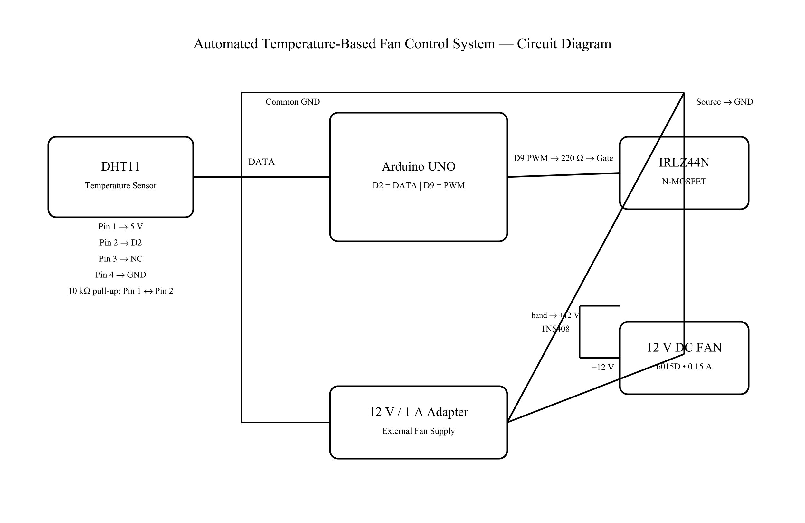

# Automated Temperature-Based Fan Control System

An Arduino UNO based automatic fan-control system that monitors ambient temperature using a DHT11 sensor and automatically adjusts the speed of a 12V DC fan.

## Project Overview

The system continuously measures the surrounding temperature using a DHT11 sensor. The Arduino UNO processes the temperature reading and generates a PWM signal to control a 12V DC fan through an IRLZ44N MOSFET.

## Objectives

- Monitor ambient temperature using a DHT11 sensor.
- Automatically control fan speed based on temperature.
- Demonstrate PWM-based motor speed control.
- Interface a microcontroller with a higher-power DC load using a MOSFET.

## Components

| Component | Specification / Role |
|---|---|
| Arduino UNO | Main microcontroller |
| DHT11 | Temperature and humidity sensor |
| IRLZ44N | N-channel MOSFET for fan control |
| 6015D DC Fan | 12V, 0.15A cooling load |
| 1N5408 | Flyback protection diode |
| Resistors | Gate and sensor pull-up/pull-down |
| DC Adapter | 12V, 1A power supply |

## Temperature-Based Control

| Temperature | Fan State |
|---|---|
| Below 30°C | OFF |
| 30–30.9°C | LOW |
| 31–31.9°C | MEDIUM |
| 32°C and above | HIGH |

## Working Principle

The DHT11 measures the ambient temperature and sends the reading to the Arduino UNO.

The Arduino compares the temperature with predefined thresholds and generates a PWM signal on digital pin D9.

The PWM signal controls the IRLZ44N MOSFET, which switches the externally powered 12V DC fan.

### System Flow

DHT11 → Arduino UNO → PWM → IRLZ44N MOSFET → 12V DC Fan

## Circuit

## Source Code

The complete Arduino program is available here:

[View Source Code](src/temperature_fan.ino)

## Testing and Results

Initial testing successfully produced temperature and humidity readings from the DHT11.

An example initial reading was:

- Temperature: approximately 29°C
- Humidity: approximately 56.4%

The temperature-based fan-control program was then tested using the predefined temperature thresholds.

Detailed experimental results are included in the project documentation.

## Project Documentation

[View Project Report](Automated_Temperature_Based_Fan_Control_System_Report.pdf)

## Problems Encountered

- The bare 4-pin DHT11 required verification of the correct pin configuration.
- A 1N4007 diode was not available, so a 1N5408 was used as the flyback protection diode.
- The first version does not include an LCD display or manual control button.

## Future Improvements

- Add an I2C LCD display.
- Add manual fan-speed control.
- Add adjustable temperature thresholds.
- Add temperature data logging.
- Add status indicators.
- Design a proper enclosure for the circuit.

## Project Status

**Working Prototype — Version 1.0**

## Author

**Geojin Mathew**

This is my first completed Arduino-based electronics project.
